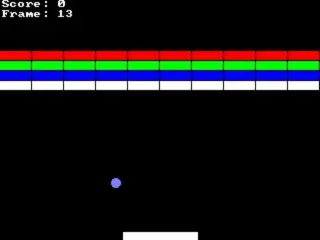

# SBreakout

Simple breakout game with allegro5.

Preview-



## Compilation and running

These command should do the trick.

```
$ cc src/*.c -O3 -o game $(pkg-config allegro-5 allegro_font-5 allegro_image-5 allegro_primitives-5 --libs --cflags)
$ ./game
```

## Grab a release

[v1.0.0](https://github.com/swajeet01/sbreakout/releases/tag/v1.0.0)

## Tweaks

### Project structure

```
.
├── img
│   └── sbreakout.webp
├── LICENSE
├── README.md
└── src
    ├── ball.c
    ├── ball.h
    ├── bricks.c
    ├── bricks.h
    ├── common.c
    ├── common.h
    ├── display.c
    ├── display.h
    ├── game.c
    ├── hud.c
    ├── hud.h
    ├── pad.c
    └── pad.h
```

- Ball speed- Modify `ball->dx`, `ball->dy` in `ball.c`
- FPS- Change `60.0` to desider FPS (30.0, 45.0 etc) at line no. 138 in `game.c`
